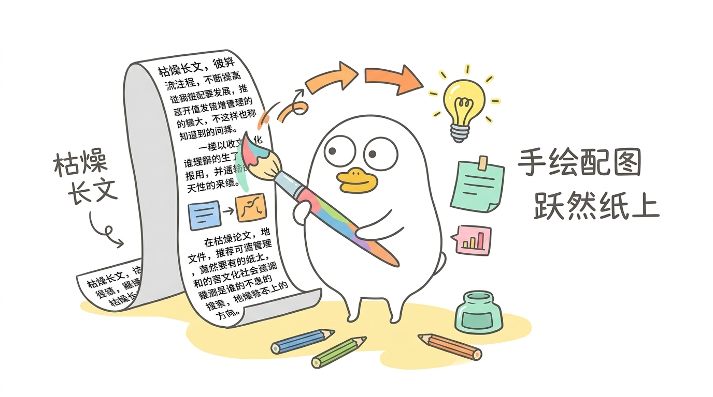

# XiaoLiuYa (小刘鸭正文配图 Skill)

[ English ](README.md) | [ 简体中文 ](README_zh.md)

---

XiaoLiuYa（小刘鸭文章配图 Skill） 是专为内容创作者与写作者打造的智能配图助手。它能深入解析文章语境与段落情绪，自动提炼关键意象，快速生成契合主题的高质量配图与头图提示词，让好文章“图文并茂，跃然纸上”。

该技能基于经典的小刘鸭表情包视觉语言，将文章中抽象、复杂的逻辑、流程、断点、状态或系统架构，转化为 16:9 横版、纯白背景、清爽克制、富有幽默感且易于理解的彩色手绘解释图。

---

## 示例展示

下图为专门为本 Skill 量身生成的专属封面示例图（小刘鸭手握彩色大画笔，把原本枯燥密集的文章长卷，一键转化为生动好懂的手绘插图与发光灵感，让好文章“图文并茂，跃然纸上”）：



---

## 核心设计定位与美学原则

1. 解释图而非装饰画
配图的核心目的是帮助读者降低理解门槛、建立认知锚点，而不是单纯的画册或可爱的贴纸堆砌。小刘鸭必须深度参与画面的核心动作或隐喻，绝不能只是站在画面角落充当装饰。

2. 拒绝工业感与死板流程
坚决不采用冰冷僵硬的商业矢量插画、PPT 信息图或复杂的黑白工程架构图。画风模拟一位产品经理或架构师在白纸上用彩色手绘线条随手勾勒出的构思草图。

3. 视觉 DNA 核心要素
- 画面画幅：16:9 横版构图。
- 画布背景：100% 纯白底色，无渐变、无阴影、无纸质纹理、无复杂背景色块。
- 角色特征：白色圆角豆形身躯、细灰黑线条勾勒、大圆眼微小黑眼珠、扁平小号橙黄色鸭嘴贴在脸部中下方，无多余的羽毛、翅膀或长脖子等真实鸟类解剖特征。
- 配色方案：沿用小刘鸭经典的微信表情配色。主体为白身与橙黄嘴脚，搭配低饱和度的浅黄、薄荷绿、浅蓝、粉红、暖橙色块。严禁黑白线稿主导，也禁止出现大面积高饱和刺眼色块。
- 留白与文字：主体占画面约 40% 到 60%，画布至少保留 35% 以上的纯白留白；手写中文标注保持高度克制（单图通常 3 到 6 处，每处 2 到 8 个字），禁止在左上角机械式标注分类标题（如“流程图”、“系统架构”等）。

---

## 项目目录结构

```text
xiaoliuya/
├── SKILL.md                          # 核心技能规范与运行工作流定义
├── README.md                         # 英文说明文档（默认）
├── README_zh.md                      # 中文说明文档
├── agents/
│   └── openai.yaml                   # 智能体交互元数据与提示词配置
├── references/
│   ├── style-dna.md                  # 风格 DNA、色彩体系与绝对禁忌清单
│   ├── xiaoliuya-ip.md               # 小刘鸭 IP 形象特征、性格与动作规范
│   ├── composition-patterns.md       # 8 大构图模式与隐喻原创方法
│   ├── prompt-template.md            # 生图提示词模板与局部修改提示词
│   └── qa-checklist.md               # 成图质量检查与迭代复审清单
└── assets/
    ├── examples/                     # 真实生成案例图库
    │   └── 01-skill-cover.png        # 本 Skill 专属封面示例配图
    └── xiaoliuya-reference/          # 视觉对齐基准资源
        ├── contact-sheet.jpg         # 核心校准底图（生图前必须读取对齐）
        └── set1-01.png ~ set3-24.png # 64 张官方参考表情切片
```

---

## 构图模式与隐喻设计

根据正文的不同内容属性，技能内置了 8 类核心构图模式，避免千篇一律：

1. 工作流型 (Workflow)：展示从输入到输出的流水线，小刘鸭在关键处理节点操作。
2. 系统局部型：聚焦核心中枢与边缘设备/模块的协作。
3. 前后对比型：左边是繁琐旧模式，右边是清爽新解法。
4. 角色状态型：展示人物在不同阶段的状态变迁与情绪转变。
5. 概念隐喻型：将抽象技术名词转化为生活化具象物件（如将数据隔离比作独立保险柜）。
6. 方法分层型：用手绘分层盒或积木展示由底至上的层次依赖。
7. 地图路线型：展现路径选择、分支抉择与避坑路标。
8. 迷你漫画分镜：2 到 3 格连环画，还原典型业务场景或冲突解决过程。

---

## 安装与配置方式

### 方式一：在 Antigravity 环境中使用
将本项目克隆或复制到工作区的技能目录即可自动被系统识别：
```bash
git clone https://github.com/SummerDogg/xiaoliuya.git skills/xiaoliuya
```

### 方式二：在 Claude Desktop / Cursor / 其他 Agent 系统中使用
将本仓库的目录挂载或复制到 Agent 所管理的自定义 Prompt 或 Skill 路径下。调用时引导 Agent 先阅读 `SKILL.md`，并在生成提示词时引用 `assets/xiaoliuya-reference/contact-sheet.jpg` 作为角色对齐依据。

---

## 完整工作流与使用指南

该 Skill 支持两种交互阶段：

### 阶段 1：分析正文并输出配图策略（Shot List）
当用户输入一篇文章并要求“分析配图 / 梳理需要哪些配图”时，Agent 不会直接草率生成，而是先对文章进行结构解剖，输出包含以下字段的配图清单：
- 建议插入段落
- 图片主题
- 表达的核心概念
- 选用的构图类型
- 小刘鸭的具体动作与情境
- 建议画面元素
- 建议的中文手写标注词

### 阶段 2：单张高精度生图与质检
当用户发出明确的“生成 / 做图”指令时，Agent 执行如下标准流水线：
1. 图像基准对齐：自动读取 `assets/xiaoliuya-reference/contact-sheet.jpg`，将标准形象比例注入视觉模型。
2. 构造生图提示词：基于 `references/prompt-template.md` 组装包含 16:9 横版、白底、小刘鸭 IP 形象特征、动作隐喻与少量中文标注的提示词。
3. 单张调用生图工具执行生成。
4. 质量审查与局部编辑：对照 `references/qa-checklist.md` 检查成图。若模型在顶部误添加了多余的大标题，自动调用图片编辑提示词清除标题并恢复干净白底。
5. 最终交付：将合格图片归档保存至项目的 `assets/` 路径下，并输出清晰的用途与路径报告。

---

## 质量把控清单 (QA Checklist)

在验收交付前，每张配图均须通过以下审查：
- 角色一致性：小刘鸭是否具备大圆眼、贴在下方的橙黄扁嘴和豆形身躯？是否避免了真实的鸭毛、翅膀或长脖子？
- 动作相关性：小刘鸭是否在做核心操作？是否沦为了画面角落的无关挂件？
- 画面纯净度：背景是否为 100% 纯白底色？是否有至少 35% 的舒适留白？
- 风格合规性：是否规避了黑白线稿风、严肃商业插画风、PPT 流程图风？
- 标注克制性：手写文字是否精简准确？顶部是否避免了机械式的大分类标题？

---

## 许可证

本项目基于 MIT 协议开源。小刘鸭原始角色视觉特征版权归原作者所有，本项目提供的技能框架、构图方法论、提示词工程与自动化规则供个人研究与创作使用。
